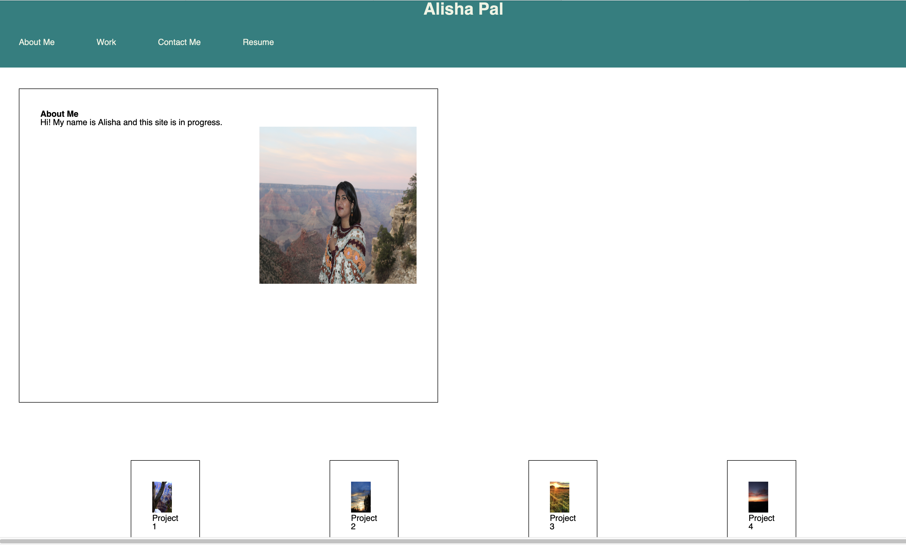

# alisha-portfolio

One paragraph of project description goes here.

## Getting Started
https://apal96.github.io/alisha-portfolio/

## Built With

* [HTML](https://developer.mozilla.org/en-US/docs/Web/HTML)
* [CSS](https://developer.mozilla.org/en-US/docs/Web/CSS)
* [Javascript](https://developer.mozilla.org/en-US/docs/Web/JavaScript)

## Deployed Link

* [See Live Site](https://apal96.github.io/alisha-portfolio/)

## Authors

* **YOUR NAME** 

- [Link to Portfolio Site](https://apal96.github.io/alisha-portfolio/)
- [Link to Github](https://github.com/apal96)
- [Link to LinkedIn](linkedin.com/in/alisha-pal-6635361b5)

## License

This project is licensed under the MIT License 
